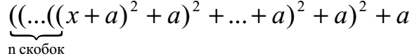
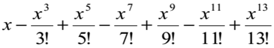
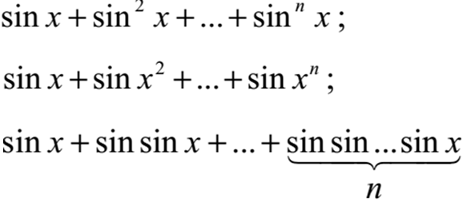
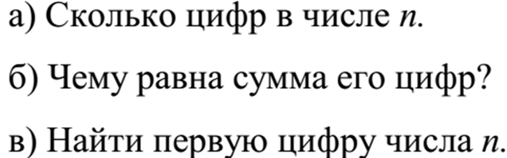
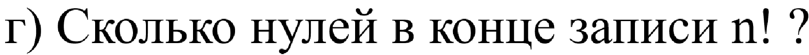
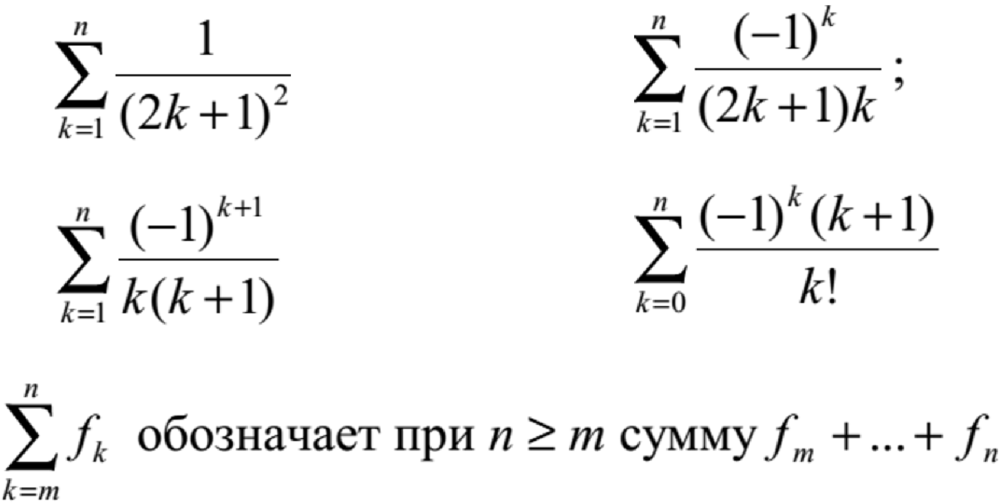

= Разбор задач на циклы

== Задача №1

=== Вычислить

== Задача №2

=== Вычислить

== Задача №3

=== Вычислить

== Задача №4

=== Дано натуральное число n

== Задача №4г

=== Дано натуральное число n

== Задача №5

=== Дано натуральное число n. Вычислить

